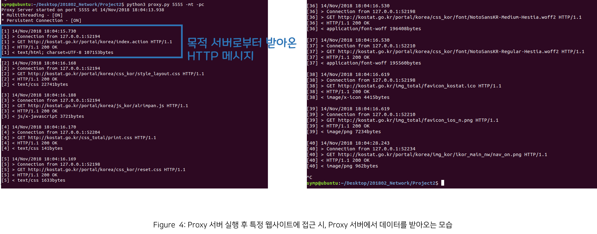
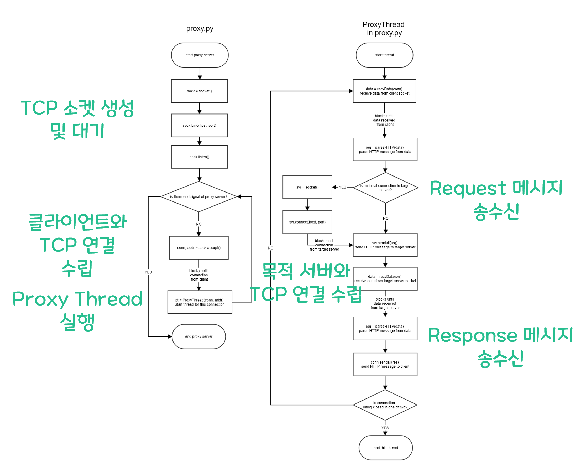
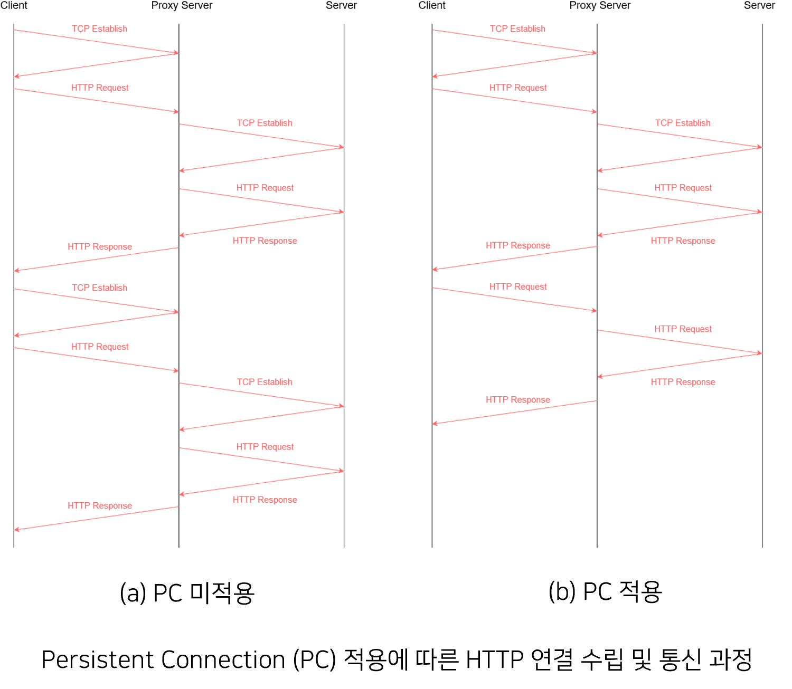
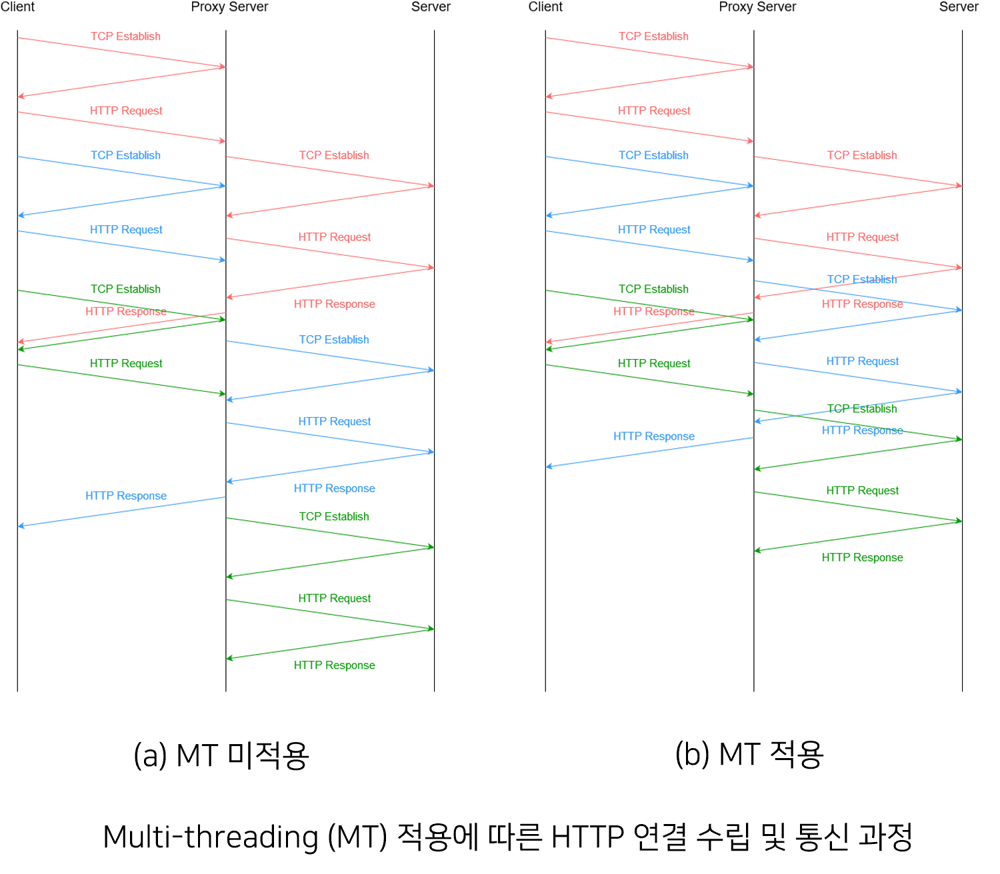
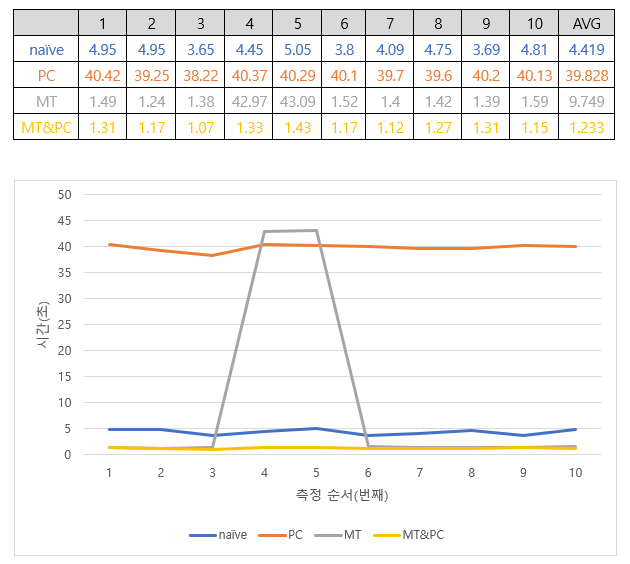
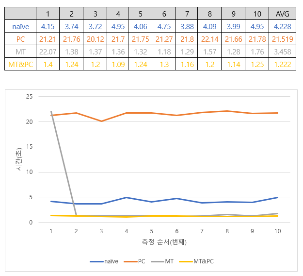

# Simple-HTTP-Proxy-Server

HTTP 1.1 부터 지원하는 Proxy 기능을 알아보고 이를 지원하는 간단한 서버를 구현한 프로젝트입니다.

해당 프로젝트는 HTTPS 연결을 지원하지 않으며 오직 HTTP 연결만을 지원합니다. 따라서, 테스트 시에 HTTP 연결에 대해서만 프록시 설정을 해주셔야 하며 HTTP 연결을 지원하는  웹 사이트에 대해서만 테스트가 가능합니다.

# Requirement

Ubuntu 18.04+ (WSL 에서 실행하셔도 됩니다)

Python 3.6+

(Optional) Firefox Web browser (HTTP 연결에 대해서만 proxy 작동 확인이 편리)

# How to use

1. Firefox를 실행시킨 뒤에 `설정 -> 네트워크 설정 -> 수동 프록시 설정 -> HTTP 프록시` 부분에 proxy server가 실행되는 ip 주소와 port 번호를 작성합니다. 예를 들어 local에서 proxy server를 5555 port 번호에서 실행할 경우, HTTP 프록시 부분에 127.0.0.1 과 5555 로 작성합니다.

2. "proxy.py" 를 실행합니다. 인자 줄 수 있는 옵션은 -mt, -pc 가 있으며, 각각 proxy 서버의 multi-threading 기능과 persistent connection 기능을 사용할지 여부를 결정합니다.

3. 프로그램을 종료하고자 할때는 `ctrl+c` 키를 눌러서 KeyboardInturrupt 를 발생시키면 됩니다.

# UI

  

# Process

  

## 1. 프록시 서버 TCP 소켓 생성 및 대기
- proxy.py에서 TCP 연결을 수립하기 위해 환영 소켓인 sock을 만든 뒤에 listen() 메소드를 통해 해당 서버로 TCP 연결을 기다립니다. 

## 2. 프록시 서버와 클라이언트 간 TCP 연결 수립 및 Proxy Thread 실행
- 프록시 서버는 클라이언트(웹 브라우저)로부터 TCP 연결을 수립하고 해당 클라이언트에게 proxy 기능을 제공하기 위한 Proxy Thread를 실행시켜서 클라이언트와 목적 서버간 Request와 Response 메시지를 송수신할 수 있도록 만듭니다. 

## 3. Request 메시지 송수신
- 목적 서버와 연결이 되지 않은 상태라면, 프록시 서버는 목적 서버와 TCP 연결을 수립합니다.
클라이언트로가 요청하는 데이터를 HTTP message format에 맞게 parsing 합니다.
parsing된 메시지를 적절하게 재조립하여 목적 서버로 해당 메시지를 보냅니다. 

## 4. Response 메시지 송수신
- 목적 서버로 부터 받아온 데이터를 역시 HTTP message format에 맞게 parsing 합니다.
parsing 결과를 자신의 sys.stdout 에 출력하고 이후에 파싱된 메시지를 적절하게 재조립하여 클라이언트로 해당 메시지를 보냅니다. 

# Feature
## 1. Persistent Connection 지원
- Persistent Connection 은 HTTP 1.1에서 추가된 기능으로, 하나의 TCP 연결을 사용하여 여러 개의 HTTP 요청/응답을 주고받아서 성능을 최적화 시키는 기법입니다.
- persistent connection을 사용할지 여부를 저장하여 Persistent Connection을 사용하지 않을 경우에는 클라이언트와 목적 서버 끼리 한번의 메세지 교환 이후에 thread가 곧바로 종료되도록 구현하였습니다.

## 2. Multi-threading 지원
- Multi-threading은 프로세스 내 작업을 여러 개의 스레드로 처리하는 기법을 말합니다. 웹 서버와 같이 여러 요청이 실시간으로 빠르게 처리해야 되는 경우, 여러 개의 프로세스로 처리하면 오버 헤드가 발생하고 비효율적인데, 이때 스레드를 사용하면 훨씬 적은 리소스를 소비하며, 한 스레드가 중단되어도 다른 스레드를 이용할 수 있기 때문에 중단되지 않고 빠른 처리가 가능합니다.
- Python의 threading 모듈에 있는 Thread 클래스를 상속받아서 ProxyThread 클래스를 설계하였고, 이후에 main()에서 client와 새로운 연결이 있을 때마다 ProxyThread의 인스턴스를 생성하고 호출함으로써 multi-threading을 구현하였습니다.  

  
  

# Performance analysis

해당 프로젝트에서 구현된 proxy 서버는 Persistent Connection (PC)과 Multi-threading (MT)기능을 지원하며, 이 두 기능이 proxy 서버의 성능에 얼마나 큰 영향을 끼치는지를 비교 분석을 진행하였습니다. 

  
  

위의 결과는 PC 와 MT 을 적용한 경우와 그렇지 않은 경우에 성능 (웹 사이트로부터 응답 시간)을 비교한 그래프입니다. 좌측은 proxy 서버가 연결된 socket으로부터 기디라는 속도(TIMEOUT)가 1초인 경우이고 우측은 0.5초인 경우입니다.

## 1. naiive
TIMEOUT에 관계없이 naiive 일때는 only MT 와 PC and MT 에 비해서 느린 것을 알 수 있습니다. 이것은 당연하게도 naiive 일때는 Multi-Threading을 사용하지 않기 때문에 데이터 처리를 동시에 할 수 없어서 Proxy의 전체 처리 속도는 늦어지게 되고 또한 Persistent Connection도 사용하지 않기 때문에 Proxy는 Client로부터 HTTP 메시지를 받을 때마다 TCP 연결을 수립하는 소켓을 생성해야 하고 또 그 소켓들을 관리해야 하는 오버헤드도 발생하여 결국엔 Client가 데이터를 받을 때까지 느끼는 응답 시간은 지연된다고 볼 수 있습니다.

## 2. only PC
한편 여기서 눈에 띄는 점은 only PC 일때 가장 느린 성능을 보여준다는 것입니다. Persistent Connection만 적용했을 경우 Multi-Threading을 사용하지 않기 때문에 proxy의 특정 쓰레드가 메시지를 처리하기 위해서는 이전 쓰레드가 종료되기를 기다려야만 합니다. 즉, 해당 쓰레드는 TIMEOUT 만큼을 기다린 뒤에 끝나고 다음 쓰레드를 처리하게 됩니다. 따라서 이 TIMEOUT 값이 너무 크면 전체 성능에 좋지 못한 영향을 끼치게 된다고 볼 수 있습니다. 이를 뒷받침하는 것이 TIMEOUT = 1, 0.5 일 때의 PC mode 응답 시간들인데, TIMEOUT =0.5 일 때가 1일 때보다 훨씬 빠른 성능(2배로 빠른 응답 시간)을 보여주고 있음을 알 수 있으며 이를 통해 TIMEOUT 값이 적어지면 적어질수록 PC mode의 성능은 향상됨을 알 수 있습니다. 

## 3. only MT
only MT 인 경우에는 Persistent Connection을 사용하지 않기 때문에 TIMEOUT 값에 관계없이 어느 정도 일정한 성능을 보여주고 있습니다. 또한 Multi-Threading을 사용하기 때문에 여러 쓰레드가 동시에 메시지를 처리할 수 있으므로 naiive 보다 더 빠른 성능을 보여줍니다. 다만 Persistent Connection을 지원하지 않기 때문에 PC and MT 보다는 약간 느린 성능을 보이고 있으며 상당히 많은 쓰레드를 관리해야 하기 때문에 OS 내부에서 이를 처리하는데 오버헤드가 생겨서 응답 시간이 매우 느리게 기록되는 현상도 간혹 보이고 있습니다.

## 4. PC and MT
마지막으로 PC and MT 의 경우 Persistent Connection과 Multi-Threading을 동시에 사용하기 때문에 이론상 다른 경우들보다 더 좋은 성능을 가지며, 실제로 측정해보니 다른 세 가지의 경우보다 안정적이고 뛰어난 성능을 보여주고 있음을 표와 그래프를 통해 알 수 있습니다.
